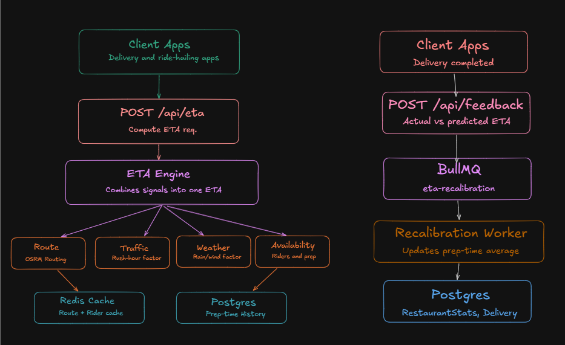

# 🚚 ETA Engine for Delivery Applications

A lightweight backend project built using **Node.js**, **TypeScript**, and **Express** that demonstrates how food delivery platforms like Swiggy, Zomato, and Uber Eats estimate delivery time.

This project intentionally avoids external infrastructure (Redis, PostgreSQL, BullMQ, Google Maps APIs) and instead implements simplified custom versions to focus on understanding backend architecture and system design fundamentals.

---

## ✨ Features

- REST API using Express
- Layered Backend Architecture
- ETA Calculation Engine
- Route Caching (Custom Redis-like Cache)
- In-Memory Database
- Background Job Queue
- Worker Processing
- Restaurant Feedback Loop
- Self-learning Average Preparation Time

---

# 🏗 Architecture



<!-- ```text
                    Client
                       │
        ┌──────────────┴──────────────┐
        │                             │
        ▼                             ▼
 POST /api/eta               POST /api/feedback
        │                             │
        ▼                             ▼
    ETA Route                  Feedback Route
        │                             │
        ▼                             ▼
     ETA Engine                    Queue
        │                             │
        ├─────────────┐               │
        │             │               ▼
        ▼             ▼            Worker
 Route Service    Database          │
        │             ▲             │
        ▼             │             ▼
 Route Cache     Restaurant Avg  Update Average
        │
        ▼
 Traffic Service
        │
        ▼
 Weather Service
        │
        ▼
Availability Service
        │
        ▼
     Final ETA
``` -->

---

# 📂 Project Structure

```
src/
│
├── server.ts
│
├── routes/
│   ├── eta.ts
│   └── feedback.ts
│
├── services/
│   ├── ETAEngine.ts
│   ├── RouteService.ts
│   ├── TrafficService.ts
│   ├── WeatherService.ts
│   └── AvailabilityService.ts
│
├── repositories/
│   ├── Database.ts
│   └── RouteCache.ts
│
├── queue/
│   ├── Queue.ts
│   └── Worker.ts
│
└── models/
    └── Delivery.ts
```

---

# ⚙️ How ETA is Calculated

The ETA Engine combines multiple independent services.

```
ETA =
Travel Time
+
(
Restaurant Prep Time
× Traffic Factor
× Weather Factor
× Rider Availability Factor
)
```

Example

```
Travel Time           = 12 mins

Restaurant Prep Time  = 15 mins

Traffic Factor        = 1.4

Weather Factor        = 1.2

Availability Factor   = 1.5

ETA = 12 + (15 × 1.4 × 1.2 × 1.5)

≈ 50 minutes
```

---

# 🚀 Running the Project

Install dependencies

```bash
npm install
```

Start Development Server

```bash
npm run dev
```

Server

```
http://localhost:3000
```

---

# 📌 API Endpoints

## 1. Calculate ETA

### POST

```
/api/eta
```

### Request

```json
{
    "restaurant": "Dominos",
    "destination": "Sector 17"
}
```

### Response

```json
{
    "eta": 42
}
```

---

## 2. Submit Delivery Feedback

### POST

```
/api/feedback
```

### Request

```json
{
    "restaurant": "Dominos",
    "actualPrepTime": 18
}
```

### Response

```json
{
    "message": "Feedback queued"
}
```

---

<!-- ---

# 🔄 Feedback Flow

```
Delivery Completed

↓

POST /api/feedback

↓

Queue

↓

Immediate Response

↓

Worker

↓

Database Update

↓

Restaurant Average Updated

↓

Future ETA Improves
```

--- -->

# 🧠 Backend Concepts Demonstrated

- REST APIs
- Layered Architecture
- Service Layer
- Repository Pattern
- Caching
- Queue
- Background Worker
- Singleton Pattern
- Dependency Separation
- ETA Calculation
- Feedback Loop
- Self-learning System

---

# 🔧 Production Mapping

| Current Implementation | Production Equivalent |
|------------------------|-----------------------|
| JavaScript Map | Redis |
| In-Memory Database | PostgreSQL / MongoDB |
| Queue.ts | BullMQ / RabbitMQ |
| Worker.ts | BullMQ Worker |
| RouteService | Google Maps API |
| WeatherService | OpenWeather API |
| TrafficService | Google Traffic API |
| AvailabilityService | Rider Management Service |

---

# 📈 Future Improvements

- PostgreSQL Integration
- Redis Cache
- BullMQ
- Google Maps API
- OpenWeather API
- Rider Tracking Service
- Machine Learning ETA Prediction
- Docker Support
- Unit Tests
- Authentication
- Persistent Delivery History

---

# 🎯 Purpose

This project was built to understand backend system design by implementing simplified versions of production components instead of relying on external services.

The goal is to understand **how delivery applications estimate ETA**, process feedback asynchronously, cache route information, and continuously improve delivery predictions using historical data.